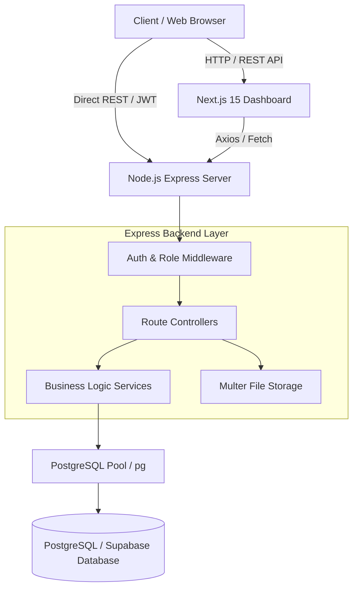
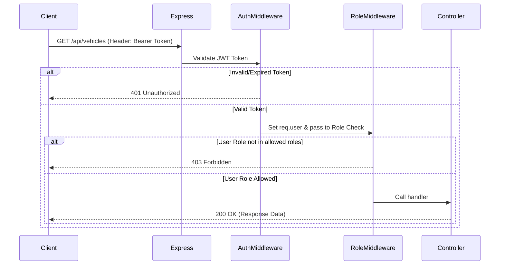

# FleetGuard System Architecture 🏗️

FleetGuard is built as a decoupled, modular system consisting of an **Express.js RESTful API Backend** powered by **PostgreSQL / Supabase**, and a modern **Next.js 15 Web Frontend**.

---

## 🏛️ High-Level Architecture

---

## 🔐 Security & Access Control

### 1. Authentication Layer
- Passwords are encrypted using **bcryptjs** (salt rounds = 10) before storage.
- Stateless authentication is powered by **JSON Web Tokens (JWT)**.
- Incoming API requests carry the token in the standard HTTP header:
  `Authorization: Bearer <token>`

### 2. Authorization (RBAC) Middleware Flow
Access control is implemented in `backend/src/middleware/auth.js` and `backend/src/middleware/roleMiddleware.js`.

### 3. Role Hierarchy & Matrix
- **Admin**: Has unconditional superuser access to all endpoints.
- **Fleet Manager**: Operational control over fleet vehicles, document compliance, driver assignments, and manager overrides.
- **Driver**: Restricted access; can submit daily pre-trip checklists and view active vehicle assignments.
- **Service Center**: Maintenance control; can create and edit service records and upload repair invoices.

---

## ⚙️ Core Backend Component Layers

### 1. Configuration (`src/config/`)
- `db.js`: Manages the PostgreSQL connection pool via `pg.Pool`. Auto-detects SSL requirement for Supabase / cloud connections.
- `initDb.js`: Ensures database schema integrity on startup. Automatically runs table DDLs, index creations, trigger definitions, and extensions (`pgcrypto`).
- `multer.js`: Configures disk storage destination (`backend/uploads/`), file size limits (5 MB max), and allowed mime types (PDF, PNG, JPG, DOC/DOCX).

### 2. Service Layer (`src/services/`)
Separates business logic from request/response controller handling:
- `riskService.js`: Calculates maintenance risk levels dynamically based on mileage gaps and intervals.
- `assignmentService.js`: Handles vehicle assignment, return, cancellation, and manager override validation.
- `complianceService.js`: Checks expiry dates of documents and updates vehicle compliance status flags (`Compliant` vs `Non-Compliant`).
- `notificationService.js`: System for generating and targeting user notifications.

### 3. Background Jobs (`src/jobs/`)
- `expiryAlertJob.js`: Scans compliance documents for upcoming expiration dates and generates automated user notifications.
- `notificationJob.js`: Periodic cleanup and batch notification dispatching.

---

## 🎨 Frontend Architecture

The frontend application (`frontend/`) is constructed with **Next.js 15 App Router** and **TypeScript**:

- **App Router (`src/app/`)**: Route handlers and page layouts for dashboard, vehicle list, service logs, driver checklists, and authentication pages.
- **Component Design (`src/components/`)**: Modular, accessible React components formatted with **Tailwind CSS v4** and **Lucide Icons**.
- **API Client (`src/services/api.ts`)**: Centralized HTTP client handling authorization headers, automatic token injection, and unified error handling.
