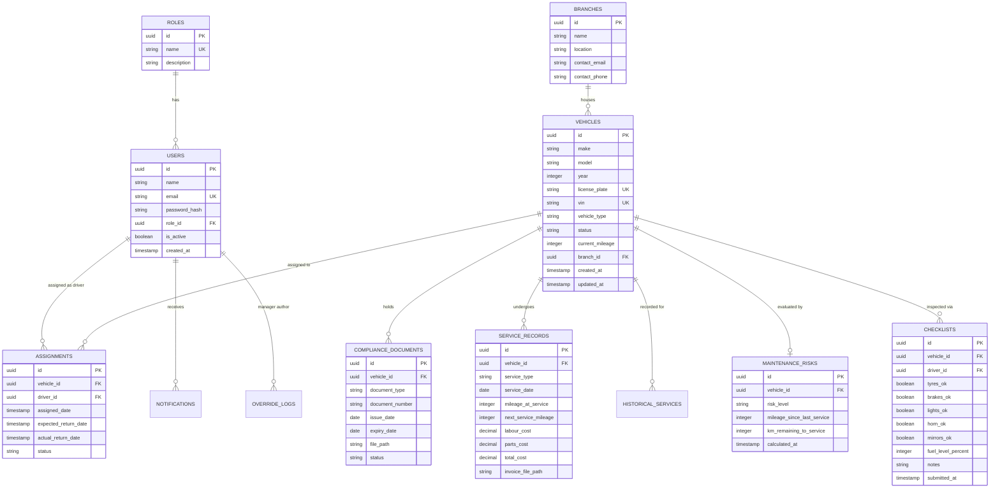

# FleetGuard Database Schema & Data Models 🗄️

FleetGuard uses **PostgreSQL** (version 14+) with relational constraints, foreign keys, automated timestamp triggers, indexes, and custom algorithms for risk scoring.

---

## 📊 Entity-Relationship Diagram (ERD)



---

## 🗂️ Core Table Definitions & Constraints

### 1. `roles`
Stores standard system roles.
- `name`: `Admin`, `Fleet Manager`, `Driver`, `Service Center` (Unique).

### 2. `users`
System credentials and profile data.
- `role_id`: FK to `roles(id)` ON DELETE RESTRICT.
- `email`: Indexed, Unique, Case-insensitive.

### 3. `vehicles`
Core registry table.
- `status`: `CHECK (status IN ('Available', 'Assigned', 'Maintenance', 'Inactive'))`.
- `current_mileage`: `CHECK (current_mileage >= 0)`.
- `year`: `CHECK (year BETWEEN 1900 AND EXTRACT(YEAR FROM CURRENT_DATE))`.

### 4. `compliance_documents`
Tracks compliance certificates.
- `document_type`: `CHECK (document_type IN ('Insurance', 'Inspection', 'PUC', 'Fitness Certificate'))`.
- `status`: `CHECK (status IN ('Valid', 'Expired', 'Pending'))`.
- `expiry_date`: `CHECK (expiry_date >= issue_date)`.

### 5. `service_records`
Logs maintenance events.
- `total_cost`: Automatically computed as `labour_cost + parts_cost` via PostgreSQL generated column:
  `total_cost NUMERIC(10,2) GENERATED ALWAYS AS (labour_cost + parts_cost) STORED`
- `next_service_mileage`: `CHECK (next_service_mileage >= mileage_at_service)`.

---

## ⚡ Maintenance Risk Scoring Engine

The maintenance risk calculation (`src/services/riskService.js`) dynamically evaluates a vehicle's breakdown probability based on service history and mileage.

### Formula & Logic:
1. **Recommended Service Interval**: Default `10,000 km` (configurable per vehicle type).
2. **Mileage Since Last Service**:
   $$\text{Mileage Since Service} = \text{Current Mileage} - \text{Last Service Mileage}$$
3. **Km Remaining**:
   $$\text{Remaining Km} = \text{Recommended Interval} - \text{Mileage Since Service}$$
4. **Risk Classification Rules**:

| Risk Level | Condition | Explanation |
|------------|-----------|-------------|
| 🔴 **HIGH** | $\text{Remaining Km} \le 0$ | Vehicle has exceeded recommended service interval. High probability of mechanical breakdown. |
| 🟡 **MEDIUM** | $0 < \text{Remaining Km} \le (0.15 \times \text{Interval})$ | Vehicle is within 15% (e.g. $\le 1,500\text{ km}$) of recommended service limit. Service due soon. |
| 🟢 **LOW** | $\text{Remaining Km} > (0.15 \times \text{Interval})$ | Vehicle is well within operational tolerances. |

---

## ⚙️ Automated Triggers & Functions

### Timestamp Auto-Update Trigger
```sql
CREATE OR REPLACE FUNCTION update_vehicle_timestamp()
RETURNS TRIGGER AS $$
BEGIN
   NEW.updated_at = NOW();
   RETURN NEW;
END;
$$ LANGUAGE plpgsql;

CREATE TRIGGER trg_update_vehicle_timestamp
BEFORE UPDATE ON vehicles
FOR EACH ROW
EXECUTE FUNCTION update_vehicle_timestamp();
```
